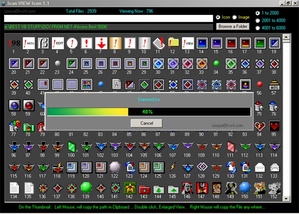

<div align="center">

## Ican\_VIEW\_Icon \(Update ver 1\.1\)


</div>

### Description

Really FAST !!! icons/bmp/jpg/jpeg/gif.

Programers like me searching suitable icons/images for every new programs, most of the time we could'ny get proper icon/image view in our browser...

i made a small icon viewer where u can view more than 150 icons/images at a time and 2000 in one shot, and 6000 icons/images from one folder. Full size preview...

VERY VERY FAST...

Loading of controls at runtime ,Cool Progress bar Picture box Scrolling and more tips for Beginer...

see the screen shot...
 
### More Info
 
you can get the selected icon/image path in clipboard or you can copy the selected icon/image into selected path.


<span>             |<span>
---                |---
**Submitted On**   |2003-12-19 11:44:10
**By**             |[Soorya](https://github.com/Planet-Source-Code/PSCIndex/blob/master/ByAuthor/soorya.md)
**Level**          |Intermediate
**User Rating**    |4.3 (39 globes from 9 users)
**Compatibility**  |VB 5\.0, VB 6\.0
**Category**       |[Complete Applications](https://github.com/Planet-Source-Code/PSCIndex/blob/master/ByCategory/complete-applications__1-27.md)
**World**          |[Visual Basic](https://github.com/Planet-Source-Code/PSCIndex/blob/master/ByWorld/visual-basic.md)
**Archive File**   |[Ican\_VIEW\_16854512192003\.zip](https://github.com/Planet-Source-Code/soorya-ican-view-icon-update-ver-1-1__1-50513/archive/master.zip)

### API Declarations

```
Private Declare Function SetWindowPos Lib _
 "user32" (ByVal hwnd As Long, ByVal hWndInsertAfter As Long, _
 ByVal X As Long, ByVal Y As Long, ByVal cx As Long, _
 ByVal cy As Long, ByVal wFlags As Long) As Long
Const HWND_TOPMOST = -1
Const HWND_NOTOPMOST = -2
Const SWP_NOMOVE = &H2
Const SWP_NOSIZE = &H1
Const TOPMOST_FLAGS = SWP_NOMOVE Or SWP_NOSIZE
```


